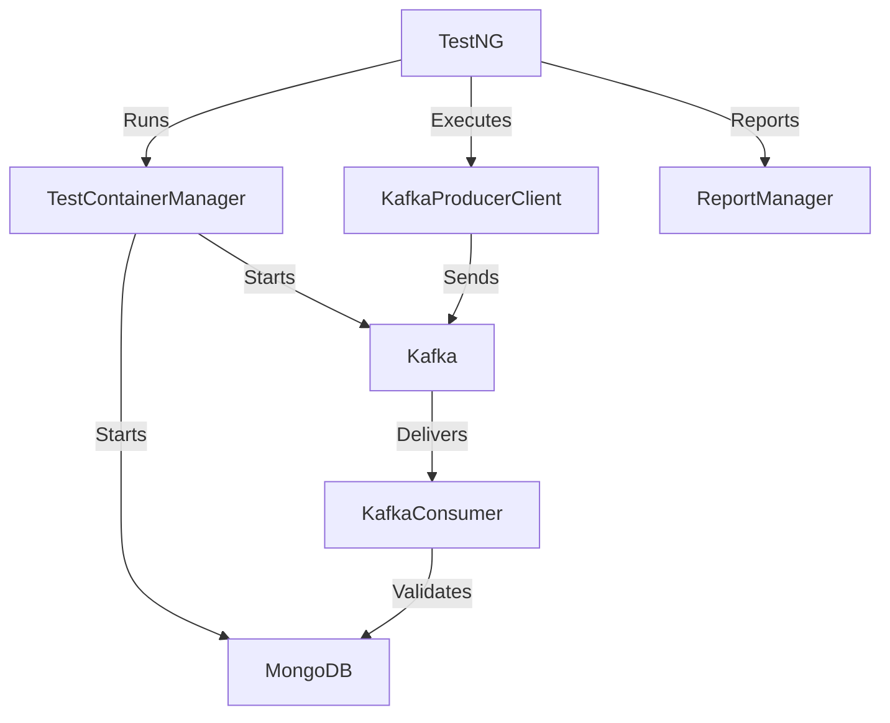

# Kafka Event Streaming Service: End-to-End Test Automation for Modern Microservices

## 1. Introduction / Hook

Ever struggled to reliably test event-driven microservices, especially those using Kafka? We did too. Manual testing was slow, error-prone, and didn’t catch subtle integration bugs. That’s why we built this project: a robust, automated test suite for Kafka-based event streaming services. It’s designed for backend engineers, QA automation folks, and anyone building or testing distributed systems with Kafka.

## 2. Project Overview

This project is a comprehensive test automation framework for validating Kafka event streaming services. It spins up containerized test environments, produces and consumes Kafka messages, verifies data integrity, and generates detailed HTML reports. The goal: make it dead simple to run end-to-end tests on your event-driven architecture, locally or in CI.

**Live Demo / Screenshots:**  
- [TestReport.html](reports/TestReport.html) (sample output)
-  *(Add a real screenshot here)*

## 3. Tech Stack

- **Java** (main language): Chosen for its strong Kafka ecosystem and test frameworks.
- **TestNG**: Flexible, annotation-driven test runner.
- **Apache Kafka**: The backbone for event streaming.
- **Testcontainers**: Spins up Kafka and MongoDB containers for isolated, repeatable tests.
- **MongoDB**: Used for persistence layer testing.
- **Maven**: Dependency management and build tool.

We picked Java/TestNG for their maturity and community support in enterprise testing. Testcontainers was a no-brainer for reliable, disposable environments.

## 4. Architecture / How It Works

**High-Level Flow:**
1. TestNG kicks off the test suite.
2. Testcontainers launches Kafka and MongoDB in Docker.
3. Test clients produce/consume messages to/from Kafka topics.
4. Data is verified against MongoDB and expected schemas.
5. Results are reported in HTML.

**Key Components:**
- `KafkaProducerClient` & `KafkaConsumer`: Handle message publishing and consumption.
- `TestContainerManager`: Orchestrates container lifecycles.
- `OrderClient`, `OrderRequest`: Model and API client for order events.
- `ReportManager`: Generates human-friendly test reports.

**System Diagram:**


**Database Schema:**  
- MongoDB stores order documents; schemas are defined in `src/main/resources/schemas/`.

## 5. Key Features

- **Containerized Testing:** No more “works on my machine”—tests run in isolated Docker containers.
- **End-to-End Coverage:** Validates the full flow from event production to DB persistence.
- **Schema Validation:** Ensures messages conform to expected JSON schemas.
- **Rich Reporting:** Generates detailed HTML reports for every test run.
- **Reusable Utilities:** Helpers for random data, file management, and config.

## 6. Challenges & How You Solved Them

- **Flaky Test Environments:** Containers sometimes failed to start or connect. We added robust retries and health checks in `TestContainerManager`.
- **Schema Drift:** Keeping JSON schemas in sync was tricky. We automated schema validation and surfaced mismatches in reports.
- **Data Race Conditions:** Kafka is asynchronous! We built polling and verification logic to handle eventual consistency.

## 7. What You Learned

- **Testcontainers** is a game-changer for integration testing.
- **Kafka’s** quirks (like message ordering and delivery guarantees) require careful test design.
- **Automated reporting** saves hours of debugging.
- Next time, we’d invest earlier in CI integration and maybe explore Kotlin for more concise test code.

## 8. Setup / How to Run It

**Prerequisites:**
- Java 11+
- Docker (for Testcontainers)
- Maven

**Installation & Run:**
```sh
git clone https://github.com/yourusername/kafka-event-streaming-service.git
cd kafka-event-streaming-service
mvn clean test
```

**Config:**
- Edit `src/main/resources/app.properties` for environment-specific settings.
- JSON schemas live in `src/main/resources/schemas/`.

**Reports:**
- After running, open `reports/TestReport.html` in your browser.

**GitHub Repo:**  
[github.com/yourusername/kafka-event-streaming-service](https://github.com/yourusername/kafka-event-streaming-service)

## 9. Future Plans

- Add support for Avro/Protobuf schemas.
- Integrate with CI/CD pipelines (GitHub Actions, Jenkins).
- More test scenarios (e.g., error handling, retries).
- UI dashboard for real-time test monitoring.

**Known Limitations:**
- Currently focused on order event flows—needs more generic topic support.
- Requires Docker; won’t run on environments without it.

## 10. Conclusion

Testing event-driven systems is hard, but it doesn’t have to be. This project makes end-to-end Kafka testing fast, reliable, and developer-friendly.  
**Try it out, give feedback, or contribute on GitHub!**

---

Let me know if you want to add code snippets, more visuals, or tailor this for a specific audience!
