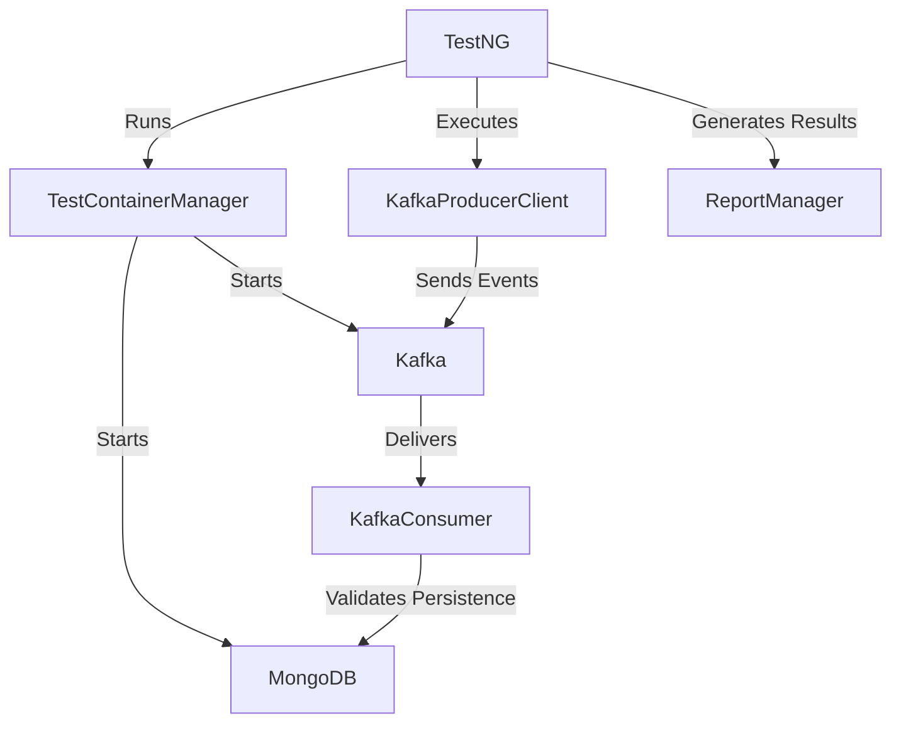

## 🛠️ Tech Stack

* **Language:** Java 11+ (Leverages enterprise maturity and a strong Kafka/testing ecosystem)
* **Test Runner:** TestNG (Annotation-driven, flexible configuration)
* **Message Broker:** Apache Kafka
* **Database:** MongoDB (Persistence layer validation)
* **Environment Orchestration:** Testcontainers (Manages isolated Docker lifecycles)
* **Build Tool:** Maven

---

## 📐 Architecture & High-Level Flow

The framework orchestrates local or CI environment resources to replicate real-world microservice data flows seamlessly.

### System Diagram



### Order of Execution

1. **Initialization:** TestNG initializes the suite run and invokes `TestContainerManager`.
2. **Infrastructure Spin-up:** Testcontainers provisions transient Docker containers for Apache Kafka and MongoDB.
3. **Event Production:** `KafkaProducerClient` publishes modeled payloads (e.g., `OrderRequest` using the `OrderClient`) into dedicated Kafka topics.
4. **Consumption & Validation:** `KafkaConsumer` polls the topics, validates JSON structural schemas, and asserts data ingestion against the MongoDB persistence layer.
5. **Reporting:** `ReportManager` compiles details into a human-readable HTML format.

---

## ✨ Key Features

* **Isolated Containerized Environments:** Eliminates configuration drift ("works on my machine") by pulling real Docker instances via Testcontainers.
* **Asynchronous Handling:** Built-in intelligent polling and verification mechanisms to gracefully handle eventual consistency and message delivery lags.
* **Automated Schema Validation:** Enforces structural contracts on runtime messages against strict JSON schemas.
* **Rich HTML Reporting:** Generates detailed visual reports after execution for quick debugging and auditing.

---

## 🚀 Setup & Getting Started

### Prerequisites

* **Java Development Kit (JDK):** Version 11 or higher
* **Docker:** Installed and running locally
* **Apache Maven:** For dependency and build lifecycle management

### Installation & Execution

Run the following commands in your terminal to clone the project and execute the suite:

```bash
# Clone the repository
git clone https://github.com/yourusername/kafka-event-streaming-service.git

# Navigate to the root directory
cd kafka-event-streaming-service

# Execute the test suite
mvn clean test

```

### Configuration Files

* **Environment Properties:** Tweak application variables inside `src/main/resources/app.properties`.
* **Data Schemas:** Manage and update structural message schemas under `src/main/resources/schemas/`.

### Viewing Reports

Upon test completion, an interactive HTML report will be generated. You can find and open it via your preferred web browser:

```text
📁 reports/TestReport.html

```

Based on the test documentation in the repository, here is the clean, structured Markdown content for your test cases. You can copy this directly into your `.md` files (such as `TC-001.md` through `TC-006.md` or a unified `TEST_CASES.md`).

---
# Test Cases: 

## TC-001: Successful End-to-End Order Processing

### Description
Verify that a valid order request submitted via the API is correctly published, consumed, and persisted with stock adjustment.

### Pre-conditions
* Kafka and MongoDB services are running.
* Product with ID `PROD-123` exists with a stock of `100`.

### Steps
1. Send a `POST` request to `/api/orders` with a valid payload containing `customerId`, `productId`, `quantity`, and `price`.
2. Verify the API response status and body.
3. Check the `orders-topic` Kafka topic for the published message.
4. Verify the `orders` collection in MongoDB for a newly created record.
5. Verify the `products` collection stock for `PROD-123`.

### Acceptance Criteria
* **Producer:** Returns `201 Created` along with a unique `orderId`.
* **Kafka:** Message in `orders-topic` contains the generated `orderId` and matches the original request payload.
* **Consumer:** Persists the order into MongoDB with a status of `PROCESSED`.
* **Database:** Product stock is decremented accurately by the requested quantity.

### Expected Behavior
The entire end-to-end flow completes within **< 2 seconds**, maintaining strict data integrity across Kafka and MongoDB.


---

## TC-002: Consumer Idempotency (Duplicate Message Handling)

### Description
Ensure that if a message is delivered multiple times (due to Kafka retries, network glitches, or consumer crashes), it is only processed once.

### Steps
1. Artificially produce two identical messages (sharing the exact same `orderId`) to the `orders-topic`.
2. Monitor consumer processing logs and database updates.

### Acceptance Criteria
* The first message is successfully processed and saved to MongoDB.
* The second message is detected as a duplicate (via a `DuplicateKeyError` on the `_id` field).
* The consumer safely commits the offset for the second message **without** updating the database or decrementing stock a second time.

### Expected Behavior
Only one record exists in MongoDB; product stock is only decremented once.


---

## TC-003: Error Handling - Malformed JSON Payload

### Description
Verify the system's "Fail-Fast" and "Isolate" behavior when encountering unparseable or corrupted messages.

### Steps
1. Manually produce a non-JSON string (e.g., `"invalid-data"`) directly to the `orders-topic`.
2. Monitor consumer logs and the `orders-dlq-topic`.

### Acceptance Criteria
* The consumer instance does not crash, hang, or stop processing.
* The consumer catches and logs a `JSONDecodeError`.
* The malformed message is automatically routed to the `orders-dlq-topic` containing an error header.
* The original topic offset is committed to successfully move past the bad message.

### Expected Behavior
Invalid data is safely quarantined to the Dead Letter Queue (DLQ) for manual inspection, and the main pipeline continues processing valid subsequent messages seamlessly.


---

## TC-004: Resilience - Database Connectivity Interruption

### Description
Verify that the consumer safely retries database operations during transient DB outages without losing data.

### Steps
1. Produce a valid order message to the `orders-topic`.
2. Stop the MongoDB service immediately before the consumer processes the incoming message.
3. Observe the consumer retry logs.
4. Restart the MongoDB service.

### Acceptance Criteria
* The consumer employs an **exponential backoff** strategy for database retries.
* The consumer **does not** commit the Kafka offset while the database failure is ongoing.
* Once MongoDB is restored, the message is processed successfully, and the offset is finally committed.

### Expected Behavior
No data loss occurs during database downtime; processing resumes automatically upon reconnection.


---

## TC-005: Producer Validation - Invalid Requests

### Description
Verify that the Producer API acts as a gateway and prevents invalid data from ever entering the Kafka ecosystem.

### Steps
1. Send a `POST` request to `/api/orders` with an invalid quantity (e.g., `quantity: -5`).
2. Send a `POST` request to `/api/orders` with a missing mandatory field (e.g., missing `productId`).

### Acceptance Criteria
* The API rejects both requests, returning an `HTTP 400 Bad Request` status.
* No payload or message is published to any Kafka topic.

### Expected Behavior
The Producer effectively validates incoming requests, ensuring only schema-valid events are allowed into the stream.

---

## TC-006: Consumer Group - Load Balancing

### Description
Verify that multiple consumer instances within the same consumer group correctly distribute partition load and scale throughput.

### Pre-conditions
* The `orders-topic` is configured with **3 partitions**.

### Steps
1. Spin up 3 distinct instances of the `KafkaConsumer` service assigned to the same `group_id`.
2. Bulk produce 30 unique order messages to the topic.

### Acceptance Criteria
* Each consumer instance handles a balanced distribution (approximately 10 messages each).
* No single message is processed by more than one consumer instance.

### Expected Behavior
Throughput scales linearly with the number of partitions and consumers, validating effective horizontal scaling.